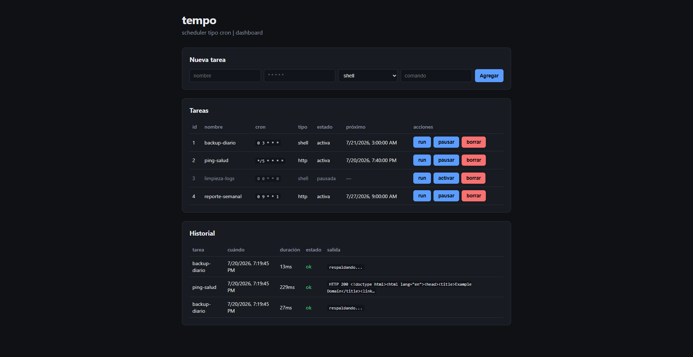

# tempo

Un scheduler tipo cron hecho desde cero en Node.js y TypeScript. Programás tareas con una
expresión cron y `tempo` las ejecuta a su hora: comandos de shell o llamadas HTTP. Se maneja
desde la terminal o desde un dashboard web, y guarda el historial de cada ejecución en SQLite.



## Qué hace

La idea es simple: le decís *qué* correr y *cuándo*, y se encarga del resto. Cada tarea tiene una
expresión cron de cinco campos (`min hora díaMes mes díaSemana`) y un tipo. Las de tipo `shell`
lanzan un comando en el sistema; las de tipo `http` hacen una request a una URL. Un proceso daemon
mira el reloj cada minuto y dispara lo que corresponde.

El corazón del proyecto es el **motor cron, escrito a mano** —sin librerías de cron—: parsea las
expresiones (con `*`, listas, rangos y pasos), resuelve el caso incómodo de "día del mes **o** día
de la semana" y calcula el próximo disparo de cada tarea. Todo se persiste en un único archivo
SQLite, así que las tareas y su historial sobreviven entre ejecuciones.

Además de la terminal, expone una API REST y un dashboard en React donde podés ver las tareas, sus
próximos disparos y el historial en vivo, y crear, pausar o borrar tareas sin tocar la consola.

## Características

- Motor cron propio: `*`, listas (`1,15`), rangos (`1-5`) y pasos (`*/10`), con la regla clásica
  del OR entre día del mes y día de la semana.
- Daemon con tick alineado al minuto (recalcula el `setTimeout` en cada vuelta, sin deriva).
- Executors de shell y HTTP con timeout, para que una tarea colgada no arrastre al resto.
- Historial de ejecuciones (estado, duración y salida) con SQLite.
- API REST + dashboard React para operar todo desde el navegador.

## Stack

Node.js · TypeScript · better-sqlite3 · commander · express · zod · vitest · React + Vite.

## Uso

```bash
npm install
```

### Desde la terminal

```bash
# agregar tareas
npm run cli -- add --name backup --cron "0 3 * * *" --type shell --command "echo respaldando"
npm run cli -- add --name ping --cron "*/5 * * * *" --type http --url https://example.com

# ver el estado y el próximo disparo de cada una
npm run cli -- list

# arrancar el scheduler (corre hasta que lo pares con Ctrl+C)
npm run cli -- start

# disparar una tarea al instante, sin esperar al cron
npm run cli -- run 1

# revisar las últimas ejecuciones
npm run cli -- history
```

### Con el dashboard web

```bash
npm run web
```

Compila el dashboard y levanta el servidor en `http://localhost:3000`, con la API y la interfaz
en el mismo puerto. Para desarrollar el front con recarga en caliente, `npm run serve` por un lado
y `npm run dashboard:dev` por el otro.

## Cómo está armado

El código está separado por responsabilidad: `cron/` (el motor), `store/` (acceso a SQLite),
`executors/` (cómo se ejecuta cada tipo de tarea), `scheduler/` (el loop del daemon), `api/` (el
servidor Express) y `commands/` (cada comando del CLI). Cada capa se apoya en la de abajo sin
conocer los detalles de las otras.

Si te interesa el *por qué* de cada decisión —desde cómo se expanden las expresiones cron hasta por
qué el dashboard y la API comparten puerto—, está todo explicado en
[RECORRIDO.md](RECORRIDO.md).

## Tests

```bash
npm test
```

## Licencia

MIT — ver [LICENSE](LICENSE).
