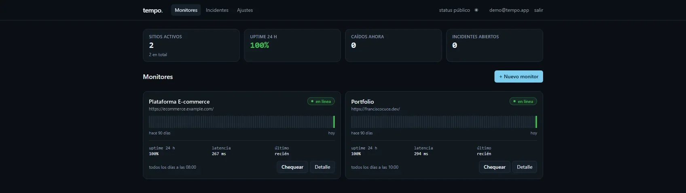
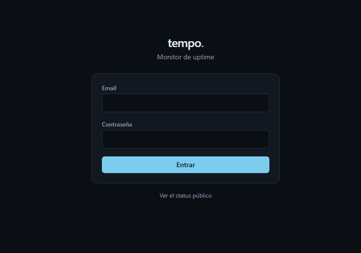

# tempo

[](https://github.com/franciscocuce/tempo-cli/actions/workflows/ci.yml)

Mi portfolio se cayó un jueves y me enteré el sábado, porque entré yo. Dos días de una URL rota en un
CV que había mandado esa misma semana.

**`tempo` es un monitor de uptime self-hosted.** Chequea que tus sitios estén vivos, te avisa por
Discord cuando se caen, y publica un status page que podés enlazar. Corre en un contenedor, guarda
todo en un archivo SQLite y el motor que agenda los chequeos está **escrito desde cero**.



## Qué hace

- **Chequea sitios** cada tanto, con la frecuencia que le pongas en formato cron.
- **Verifica que funcione, no solo que responda.** Además del código de estado (acepta `200`, `2xx`,
  `200-299` o listas), puede buscar una palabra en la respuesta. Un 200 que devuelve la pantalla de
  error de tu framework es una caída que un chequeo de status no ve.
- **No alerta por un hipo de red.** Hacen falta N fallos seguidos (configurable) para declarar un
  sitio caído y abrir un incidente.
- **Avisa por Discord** al caer y al recuperarse, con cuánto duró la caída.
- **Vigila el certificado TLS** y avisa antes de que venza.
- **Calcula disponibilidad**: uptime de 24 h, 7 y 30 días, latencia p50 y p95, y una barra de 90 días.
- **Publica un status page** en `/status`, sin login, que no filtra ni las URLs que vigilás.
- **Se maneja desde la terminal o desde el navegador**, sobre la misma base.

## Arrancarlo

```bash
cp .env.example .env
# generá la clave y pegala en TEMPO_SECRET_KEY:
node -e "console.log(require('crypto').randomBytes(32).toString('hex'))"

docker compose up -d
```

Abrí `http://localhost:3000`. El primer arranque imprime en la consola un **token de un solo uso**
para crear el primer usuario:

```bash
docker compose logs | grep -A2 "token"
```

No hay contraseña por defecto, ni la va a haber.



<details>
<summary>Sin Docker</summary>

```bash
npm install
export TEMPO_SECRET_KEY=$(node -e "console.log(require('crypto').randomBytes(32).toString('hex'))")
npm run web          # compila el dashboard y levanta todo en :3000
```

</details>

## Desde la terminal

```bash
tempo add --name portfolio --url https://franciscocuce.dev --cron "*/5 * * * *"
tempo add --name blog --url https://ejemplo.com --cron "0 * * * *" --keyword "Bienvenido"

tempo list                    # estado, uptime y próximo chequeo de cada uno
tempo check 1                 # chequear uno ahora mismo
tempo incidents --open        # las caídas sin resolver
tempo history --monitor 1

tempo channel add --label "mi server" --url "https://discord.com/api/webhooks/..."
tempo channel test 1

tempo backup ~/backups/       # copia en caliente, sin parar nada
tempo restore ~/backups/tempo-2026-08-24.db
```

## Comparado con otras opciones

Honestamente: si solo querés que alguien te avise cuando se cae tu sitio, **usá UptimeRobot y listo**.
`tempo` tiene sentido si querés que los datos sean tuyos o si te interesa cómo está hecho por dentro.

| | cron + curl | UptimeRobot (gratis) | Uptime Kuma | tempo |
|---|---|---|---|---|
| Instalar algo | no | no | sí | sí |
| Frecuencia mínima | la que quieras | 5 min | la que quieras | la que quieras |
| Tus datos en tu máquina | sí | no | sí | sí |
| Integraciones de aviso | las que escribas | muchas | 90+ | solo Discord |
| Madurez | no aplica | producto | proyecto grande y probado | proyecto personal |

**Uptime Kuma hace todo lo que hace `tempo` y bastante más.** `tempo` existe porque quería construir
el motor, no porque el mundo necesitara otro monitor.

## Cómo está hecho

Node.js · TypeScript · SQLite (`better-sqlite3`) · Express · zod · vitest · React + Vite + Tailwind v4

```
src/cron/        el motor cron, escrito a mano
src/checks/      chequeo HTTP, guard anti-SSRF, lectura del certificado
src/incidents/   cuándo se abre y se cierra una caída
src/scheduler/   el loop, el lock de instancia única, el runner
src/store/       todo el SQL, una función por operación
src/api/         Express: rutas, sesión, CSRF, SSE, status público
src/commands/    un archivo por comando del CLI
dashboard/       React + Vite, gráficos en SVG a mano
```

Tres cosas que quizás te interesen:

- **El motor cron es propio.** Parsea los cinco campos con `*`, listas, rangos y pasos, y resuelve la
  regla incómoda de "día del mes **o** día de la semana". No usa librería de cron.
- **El scheduler está endurecido**: no solapa chequeos del mismo monitor, limita la concurrencia,
  desparrama los disparos con jitter, y un lock en SQLite impide que dos daemons vigilen la misma base.
- **Los gráficos son SVG escrito a mano**, sin librería de charts.

## Desarrollo

```bash
npm test              # 268 tests
npm run lint
npm run typecheck
npm run serve         # API en :3000
npm run dashboard:dev # Vite con recarga en caliente, proxy a la API
```

## Licencia

MIT. Ver [LICENSE](LICENSE).
